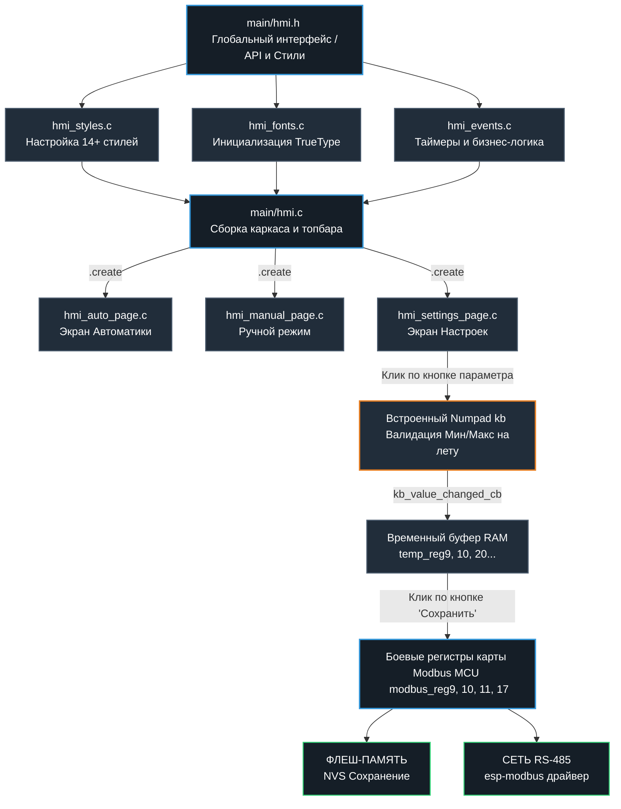

```mermaid
graph TD
    %% Стилизация блоков
    classDef main fill:#151E27,stroke:#3498DB,stroke-width:2px,color:#fff;
    classDef node fill:#212D3A,stroke:#4E5E70,stroke-width:1.5px,color:#fff;
    classDef alert fill:#212D3A,stroke:#E67E22,stroke-width:2px,color:#fff;
    classDef final fill:#151E27,stroke:#2ECC71,stroke-width:1.5px,color:#fff;

    %% Узлы графа
    HMI_H[main/hmi.h <br> Глобальный интерфейс / API и Стили]:::main
    
    STYLES_C[hmi_styles.c <br> Настройка 14+ стилей]:::node
    FONTS_C[hmi_fonts.c <br> Инициализация TrueType]:::node
    EVENTS_C[hmi_events.c <br> Таймеры и бизнес-логика]:::node
    
    HMI_C[main/hmi.c <br> Сборка каркаса и топбара]:::main
    
    AUTO_P[hmi_auto_page.c <br> Экран Автоматики]:::node
    MANUAL_P[hmi_manual_page.c <br> Ручной режим]:::node
    SETTINGS_P[hmi_settings_page.c <br> Экран Настроек]:::node
    
    NUMPAD[Встроенный Numpad kb <br> Валидация Мин/Макс на лету]:::alert
    BUFFER[Временный буфер RAM <br> temp_reg9, 10, 20...]:::node
    
    REGISTERS[Боевые регистры карты Modbus MCU <br> modbus_reg9, 10, 11, 17]:::main
    
    NVS[ФЛЕШ-ПАМЯТЬ <br> NVS Сохранение]:::final
    MODBUS[СЕТЬ RS-485 <br> esp-modbus драйвер]:::final

    %% Связи
    HMI_H --> STYLES_C
    HMI_H --> FONTS_C
    HMI_H --> EVENTS_C
    
    STYLES_C --> HMI_C
    FONTS_C --> HMI_C
    EVENTS_C --> HMI_C
    
    HMI_C --> |.create| AUTO_P
    HMI_C --> |.create| MANUAL_P
    HMI_C --> |.create| SETTINGS_P
    
    SETTINGS_P --> |Клик по кнопке параметра| NUMPAD
    NUMPAD --> |kb_value_changed_cb| BUFFER
    
    BUFFER --> |Клик по кнопке 'Сохранить'| REGISTERS
    
    REGISTERS --> NVS
    REGISTERS --> MODBUS
```
